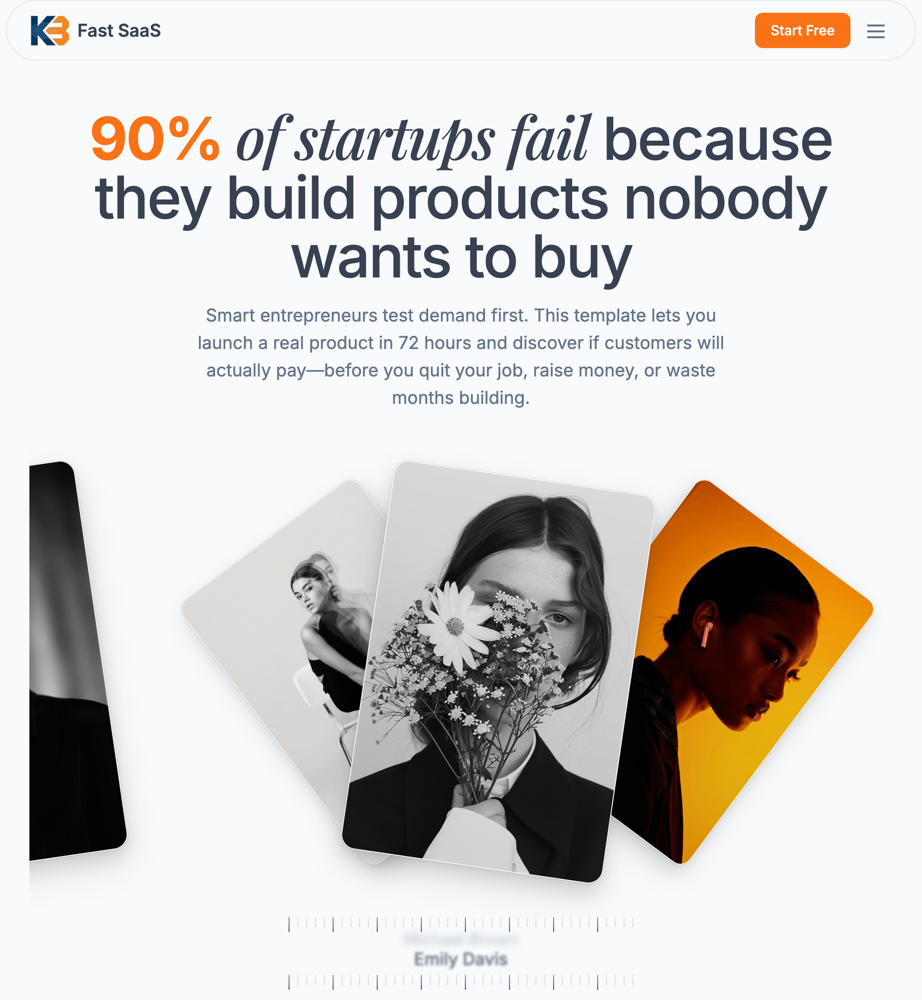

# 🚀 Fast SaaS Template

> **90% of startups fail because they build products nobody wants to buy.** Smart entrepreneurs test demand first. This template lets you launch a real product in 72 hours and discover if customers will actually pay—before you quit your job, raise money, or waste months building.

<p align="center">
  <a href="https://github.com/kashbadami/fast-saas-template/stargazers"></a>
  <a href="https://github.com/kashbadami/fast-saas-template/network/members"></a>
  <a href="https://github.com/kashbadami/fast-saas-template/blob/main/LICENSE"></a>
  <a href="https://nextjs.org"></a>
  <a href="https://www.typescriptlang.org"></a>
</p>

<p align="center">
  <a href="#-features">Features</a> •
  <a href="#-quick-start">Quick Start</a> •
  <a href="#-tech-stack">Tech Stack</a> •
  <a href="#-documentation">Documentation</a> •
  <a href="#-demo">Demo</a> •
  <a href="#-support">Support</a>
</p>

## 🎯 Why Fast SaaS?

Building a SaaS product is risky. You could spend months perfecting features only to discover no one wants to pay for it. This template flips the script:

1. **Launch in 72 hours** - Not months
2. **Test with real users** - Not assumptions
3. **Validate payment intent** - Not just interest
4. **Pivot fast** - Not sink with the ship

## 🖼️ Screenshots

<details open>
<summary>Click to view screenshots</summary>

### Landing Page Hero Section


### Feature-Rich Components


### Problem-Solution Section


</details>

## ✨ Features

### 🔐 Authentication & Security
- **Email/Password** authentication with secure hashing
- **OAuth** integration (Google, Discord, GitHub ready)
- **Email verification** with beautiful transactional emails
- **Password reset** flow with secure tokens
- **Session management** with JWT tokens

### 💳 Payments & Billing
- **Stripe** integration ready to go
- **Subscription** management
- **Usage-based** billing support
- **Customer portal** for self-service
- **Webhook** handling for real-time updates

### 📧 Email System
- **Transactional emails** with AWS SES
- **Beautiful templates** that convert
- **Email verification** system
- **Welcome emails** that engage
- **Provider abstraction** (easily switch between providers)

### 📁 File Storage
- **S3 integration** out of the box
- **Local storage** for development
- **Signed URLs** for secure access
- **File upload** components ready
- **Provider abstraction** (S3, Google Cloud, Azure ready)

### 🎨 UI/UX Excellence
- **Beautiful components** with shadcn/ui
- **Premium UI blocks** from [shadcnblocks.com](https://www.shadcnblocks.com) (💰 Paid - worth every penny!)
- **Dark mode** support
- **Responsive design** that works everywhere
- **Accessibility** first approach
- **Loading states** and error handling

### 🛠️ Developer Experience
- **Type safety** with TypeScript everywhere
- **API routes** with tRPC for end-to-end type safety
- **Database** with Prisma ORM
- **Hot reload** for instant feedback
- **ESLint & Prettier** pre-configured
- **Git hooks** for code quality

## 🚀 Quick Start

### One-Line Setup

```bash
npx degit kashbadami/fast-saas-template my-saas && cd my-saas && npm install && cp .env.example .env && git init && git add -A && git commit -m "Initial commit"
```

### Interactive Setup (Coming Soon)

```bash
npx create-fast-saas my-saas
```

### Manual Setup

```bash
# Clone the repository
git clone https://github.com/kashbadami/fast-saas-template.git my-saas
cd my-saas

# Remove existing git history
rm -rf .git

# Initialize new git repository
git init

# Install dependencies
npm install

# Set up environment variables
cp .env.example .env
# Edit .env with your configuration

# Set up database
npm run db:push

# Create initial commit
git add -A
git commit -m "Initial commit from fast-saas-template"

# Start development server
npm run dev
```

Your app is now running at [http://localhost:3000](http://localhost:3000) 🎉

### Deploy to GitHub

```bash
# Create a new repository on GitHub, then:
git remote add origin https://github.com/YOUR_USERNAME/YOUR_REPO.git
git push -u origin main
```

## 🛠️ Tech Stack

- **Framework**: [Next.js 15](https://nextjs.org) (App Router)
- **Styling**: [Tailwind CSS v4](https://tailwindcss.com) + [shadcn/ui](https://ui.shadcn.com)
- **UI Components**: Premium blocks from [shadcnblocks](https://www.shadcnblocks.com) 💰
- **Database**: [PostgreSQL](https://postgresql.org) + [Prisma](https://prisma.io)
- **Authentication**: [NextAuth.js v5](https://authjs.dev)
- **API**: [tRPC](https://trpc.io) for type-safe APIs
- **Email**: [AWS SES](https://aws.amazon.com/ses) (with fallback providers)
- **Storage**: [AWS S3](https://aws.amazon.com/s3) (with local dev support)
- **Payments**: [Stripe](https://stripe.com) (ready to integrate)
- **Deployment**: [Vercel](https://vercel.com) (or any Node.js host)

> **Note on UI Components**: This template uses premium UI blocks from [shadcnblocks.com](https://www.shadcnblocks.com). While the core shadcn/ui components are free and open source, shadcnblocks provides professionally designed, production-ready component blocks that require a paid subscription. The blocks used in this template have been customized and integrated - you'll need your own shadcnblocks subscription if you want to access their full library of components.

## 📚 Documentation

Visit our [comprehensive documentation](./docs) to learn:

- 📖 [Getting Started Guide](./docs/getting-started.md)
- 🔐 [Authentication Setup](./docs/google-auth-setup.md)
- 📧 [Email Configuration](./docs/email-setup.md)
- 📁 [File Storage Guide](./docs/file-storage.md)
- 🎨 [Content Configuration](./docs/content-configuration.md)

## 🏗️ Project Structure

```
fast-saas-template/
├── src/
│   ├── app/              # Next.js app router pages
│   ├── components/       # React components
│   ├── server/          # Server-side code
│   │   ├── api/         # tRPC API routes
│   │   ├── auth/        # Authentication config
│   │   ├── db.ts        # Database client
│   │   ├── email/       # Email providers
│   │   └── storage/     # File storage providers
│   ├── config/          # Content & branding config
│   ├── lib/             # Utility functions
│   └── styles/          # Global styles
├── prisma/              # Database schema
├── public/              # Static assets
└── docs/                # Documentation
```

## 🎯 Perfect For

- **🚀 Entrepreneurs** validating business ideas
- **👨‍💻 Indie Hackers** shipping fast
- **🏢 Startups** testing product-market fit
- **🧪 Developers** building side projects
- **📈 Agencies** delivering client projects

## 🛡️ Security

- ✅ SQL injection protection with Prisma
- ✅ XSS protection built-in
- ✅ CSRF protection with NextAuth
- ✅ Rate limiting ready
- ✅ Input validation with Zod
- ✅ Secure session management
- ✅ Environment variable validation

## 🚢 Deployment

### Vercel (Recommended)

[](https://vercel.com/new/clone?repository-url=https://github.com/yourusername/fast-saas-template)

### Railway

[](https://railway.app/new/template?template=https://github.com/yourusername/fast-saas-template)

### Other Platforms

This template works with any Node.js hosting platform:
- AWS (Amplify, EC2, ECS)
- Google Cloud Platform
- DigitalOcean
- Heroku
- Render

## 📊 Performance

- ⚡ **Lighthouse Score**: 95+
- 🚀 **First Contentful Paint**: < 1s
- 📱 **Mobile Optimized**: 100%
- ♿ **Accessibility**: WCAG 2.1 AA compliant

## 🤝 Contributing

We love contributions! Please see our [Contributing Guide](CONTRIBUTING.md) for details.

```bash
# Fork the repo
# Create your feature branch
git checkout -b feature/amazing-feature

# Commit your changes
git commit -m 'Add amazing feature'

# Push to the branch
git push origin feature/amazing-feature

# Open a Pull Request
```

## 📝 License

This project is licensed under the MIT License - see the [LICENSE](LICENSE) file for details.

## 💖 Support

If this template helps you ship faster:

- ⭐ **Star** this repo
- 🐦 **Tweet** about it
- 📝 **Blog** about your experience
- 💰 **Sponsor** future development

## 🙏 Acknowledgments

Built with amazing open source projects:

- [Next.js](https://nextjs.org) by Vercel
- [shadcn/ui](https://ui.shadcn.com) by @shadcn
- [Tailwind CSS](https://tailwindcss.com) by Tailwind Labs
- [Prisma](https://prisma.io) by Prisma Labs
- [tRPC](https://trpc.io) by @alexdotjs

Premium UI components from:

- [shadcnblocks](https://www.shadcnblocks.com) - Beautiful, production-ready components (💰 Paid subscription required for full access)

---

<p align="center">
  Made with ❤️ by entrepreneurs, for entrepreneurs
</p>

<p align="center">
  <a href="https://twitter.com/yourusername">Twitter</a> •
  <a href="https://discord.gg/yourdiscord">Discord</a> •
  <a href="https://github.com/yourusername/fast-saas-template/issues">Issues</a>
</p>